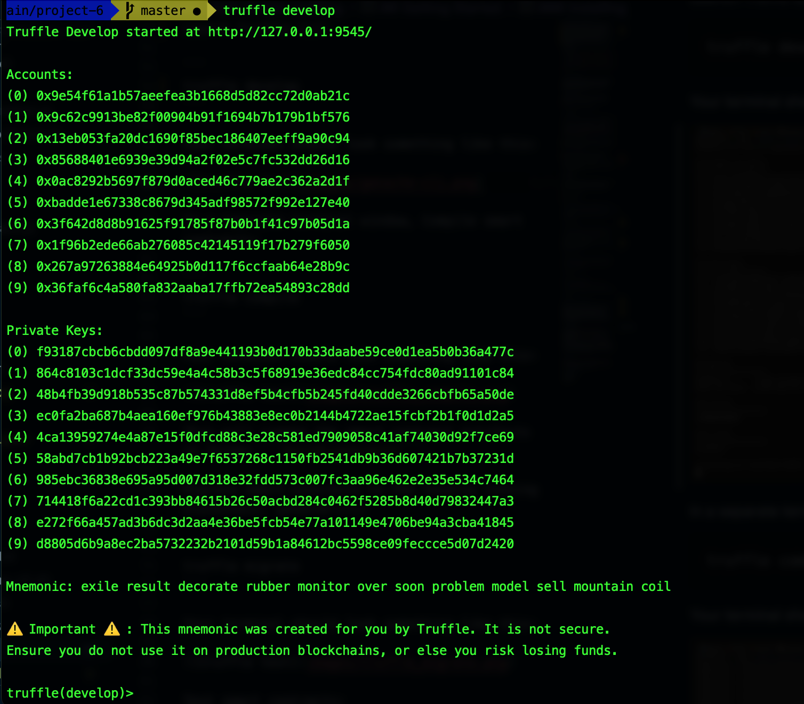
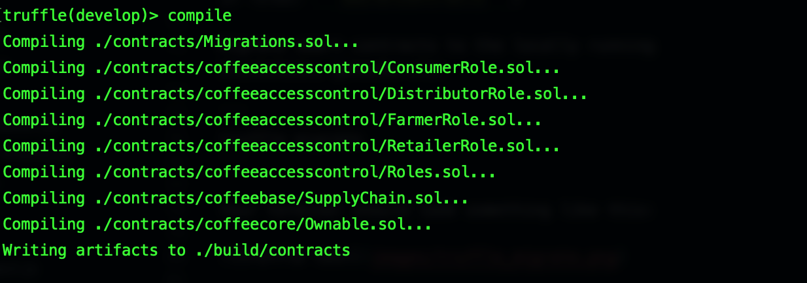

# Supply chain & data auditing

This repository contains an Ethereum DApp that demonstrates a Supply Chain flow between a Seller and Buyer. The user story is similar to any commonly used supply chain process. A Seller can add items to the inventory system stored in the blockchain. A Buyer can purchase such items from the inventory system. Additionally a Seller can mark an item as Shipped, and similarly a Buyer can mark an item as Received.

## UML

Here is the [UML document](docs/UML_-_Tracking_Items_through_Supply_Chain.pdf) that provides details regarding the application design.

## Preview

The DApp User Interface when running should look like...


## Getting Started

These instructions will get you a copy of the project up and running on your local machine for development and testing purposes. See deployment for notes on how to deploy the project on a live system.

### Prerequisites

Please make sure you've already installed Node (*v10*), Truffle (*v5*) and enabled MetaMask extension in your browser.

### Tools

- **Node:** 10.24.1
- **Truffle:** 5.0.2
- **Solidity:** 0.5.1
- **Web3:** 0.20.6

### Installing

> The starter code is written for **Solidity v0.4.24**. At the time of writing, the current Truffle v5 comes with Solidity v0.5 that requires function *mutability* and *visibility* to be specified (please refer to Solidity [documentation](https://docs.soliditylang.org/en/v0.5.0/050-breaking-changes.html) for more details). To use this starter code, please run `npm i -g truffle@4.1.14` to install Truffle v4 with Solidity v0.4.24. 

A step by step series of examples that tell you have to get a development environment running

Clone this repository:

```
git clone https://github.com/barbietunnie/DApp-Item-Tracker-Through-Supply-Chain
```

Change directory to ```project-6``` folder and install all requisite npm packages (as listed in ```package.json```):

```
cd project-6
npm install
```

Create the secret files `.secret` and `.infura` in `project-6` folder to hold your truffle mnemonic and infura api keys respectively.


Launch Truffle CLI:

```
truffle develop
```

Your terminal should look something like this:



In a separate terminal window, Compile smart contracts:

```
compile
```

Your terminal should look something like this:



This will create the smart contract artifacts in folder ```build\contracts```.

Migrate smart contracts to the locally running blockchain using truffle-cli:

```
migrate
```

Your terminal should look something like this:


Test smart contracts:

```
test
```

All 10 tests should pass.


In a separate terminal window, launch the DApp:

```
npm run dev
```

### Testing in the browser

Based on the facilities currently provided by the web app, there is no way to create different roles at the moment, so the roles that were automatically created during deployment by the first account / deploy account should be used to perform the test, as a role has been created for each scenario you will encounter.

## Contract Address

The contract is deployed on [Ropsten Testnet network](https://ropsten.etherscan.io/address/0x1AdDF1527aE3c49774E189b437d226EF392881A0) as against Rinkeby due to timeouts experienced while attempting to deploy on the Rinkeby Test network

## Libraries used

- **lite server**: A lightwieght node server that serves the web app and automatically refreshes the page when file changes are detected, during development.
- **truffle-hdwallet-provider**: HD-wallet enabled web3 provider for developing smart contracts.
- **web3.js**: Ethereum Javascript API that allows you to interact with a local or remote ethereum node using HHTP, IPC or Websocket.
- **jQuery**: Easy to use Javascript library that makes working across multitude of browsers straightforward.
- **ethjs-abi**: Used for encoding and decoding from the `ethers-wallet`.
- **truffle-blockchain-utils**: Utilities for identifying and managing blockchains

## IPFS

*IPFS was not used in the project.*

## Built With

* [Ethereum](https://www.ethereum.org/) - Ethereum is a decentralized platform that runs smart contracts
* [IPFS](https://ipfs.io/) - IPFS is the Distributed Web | A peer-to-peer hypermedia protocol
to make the web faster, safer, and more open.
* [Truffle Framework](http://truffleframework.com/) - Truffle is the most popular development framework for Ethereum with a mission to make your life a whole lot easier.


## Authors

See also the list of [contributors](https://github.com/your/project/contributors.md) who participated in this project.

## Acknowledgments

* Solidity
* Truffle
* IPFS
